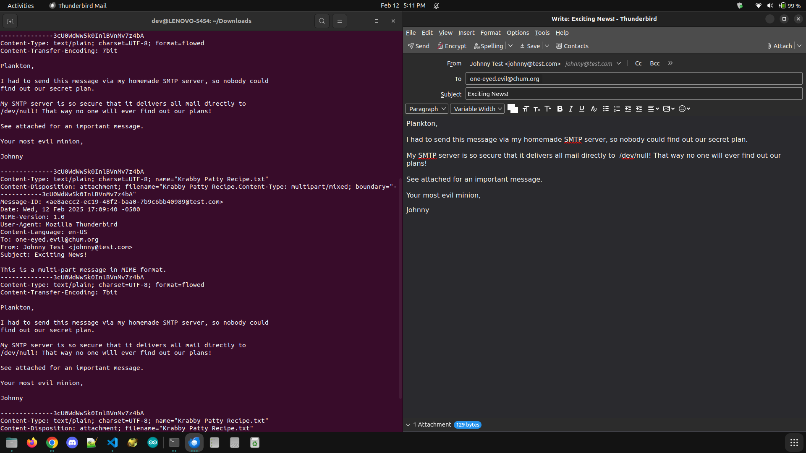

# CIS457-NUSA
Elijah Morgan\
CIS 457 01

# NUll Submission Agent

The first project for CIS457: Data Communication.
NUSA is a rudimentary Messege Submission Agent (MSA) which only communicates with a Mail User Agent (MUA). After receiving the "end of message" marker, a real MSA would ship the message to the destination SMTP server. \
NUSA does not push the incoming messages to the actual mail transport network, instead it performs the following tasks:

[Outline of project requirements and expectations.](https://dulimarta-teaching.netlify.app/cs457/p1-nsa.html)

## Required Features

* Verify the recipient address (provided in RCPT TO) satisfy the following rules for a valid email:
  * Ends with: .com, .org, .net, .edu, .io, .app
  * It contains exactly one @ character separating the username and domain name.
  * The domain name is not empty and contains only alphanumeric characters.
  * The username is not empty .

    **When any of these rules is not satisfied, the MSA must respond with 550 status that includes the nature of the error after the numeric code, such as 550 Unknown TLD**

* Verify that the client does not attempt to send the message to more than five recipients.

* Verify the subject line is not blank.

* Print the entire message body to stdout. Your code shall be able to consume message body beyond the buffer size used for reading incoming bytes from the socket.

* In addition, your MSA implementation must be able to handle:

  * A message of any size, specifically your program should not have a limit on the size of message body provided between the DATA command and the end of message marker.
  
  * Any type of attachment in the message body.

 * Your MSA shall be designed to handle several MUA client connections simultaneously.

### Extra Credit
For an extra credit, parse the message body for attachments and count the number of attached files. Respond with an error code 550 if too many files (> 5) are attached in the message.

Refer to RFC 2045 to understand how attachments are identified both in the message header and message body. This document is actually the first part of five:

    RFC2045: MIME Part 1: Format of Internet Message Bodies
    RFC2046: MIME Part 2: Media Types
    RFC2047: MIME Part 3: Message Header Extensions for Non-ASCII Text
    RFC2048: MIME Part 4: Registration Procedure
    RFC2049: MIME Part 5: Conformance Criteria and Examples

You may be interested in reading Part 1 and Part 5, and skip Part 2-Part 4. In particular, Part 5 shows an example of embedding attachments in the message body.

### Note
**By default, this program is set to only work locally (localhost) on port 9000** \
If you would like to try this out on your own, you will have to modify your email client settings.